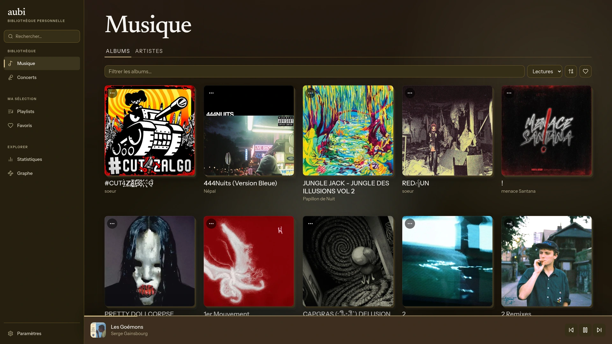
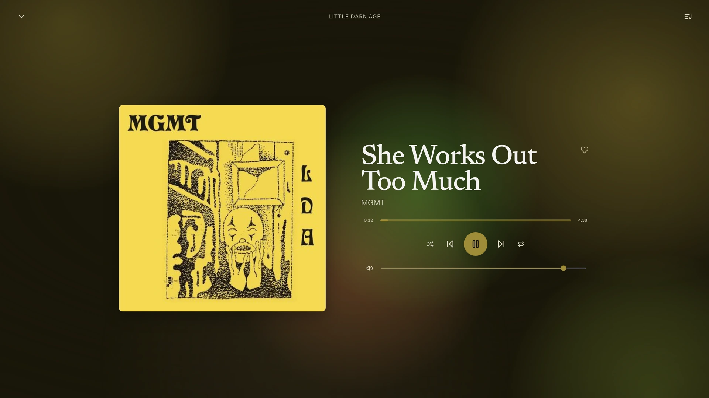
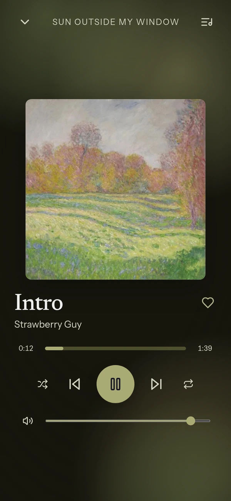
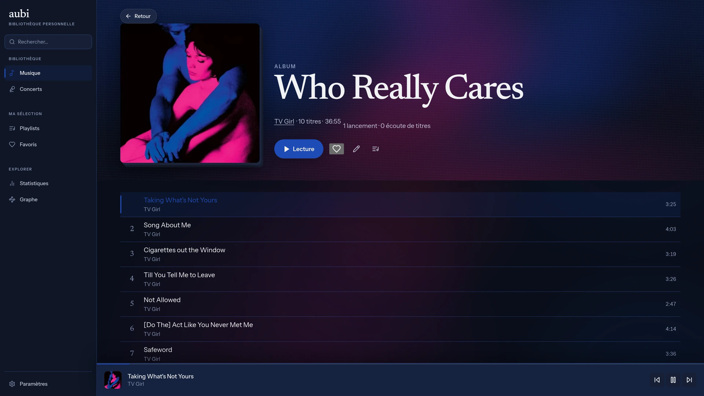
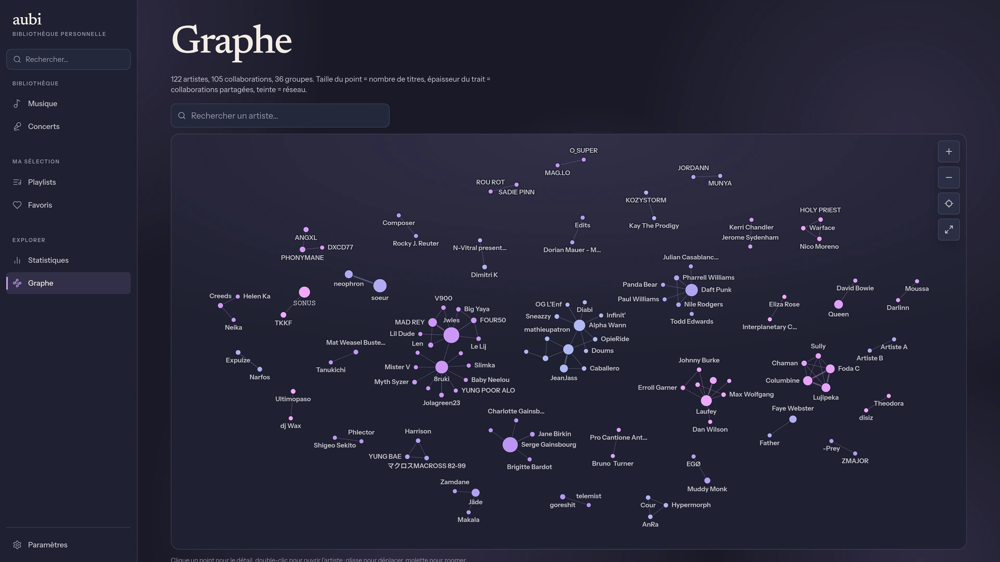
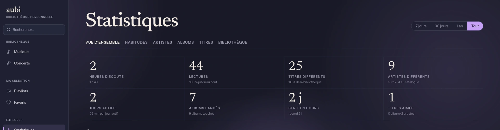
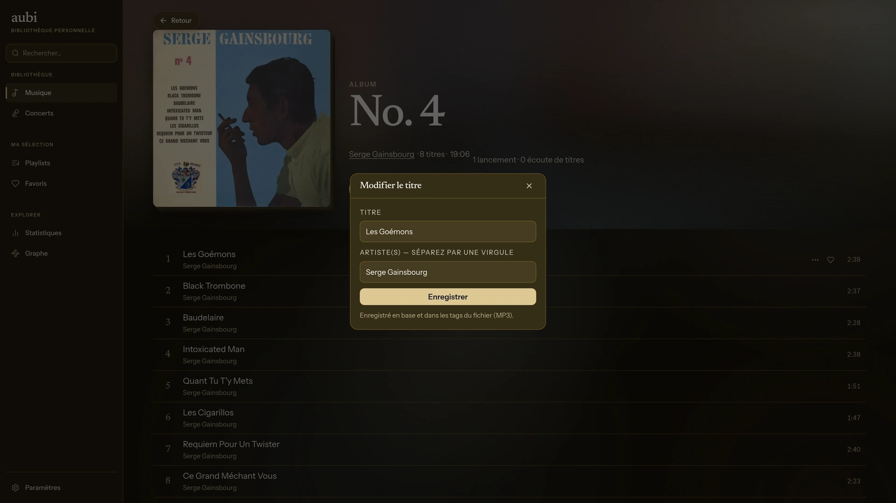
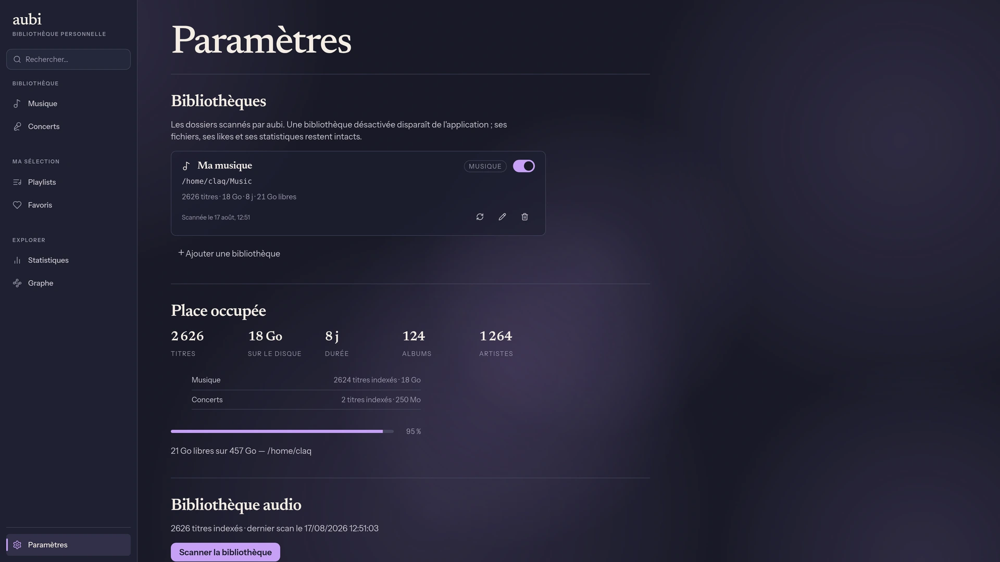

# aubi

Votre bibliothèque audio, chez vous, sur tous vos appareils.

aubi lit les fichiers audio d'un dossier de votre machine et les sert dans une
interface web installable sur téléphone. Musique, concerts et livres audio, avec
pochettes, playlists, favoris, statistiques d'écoute, correction des tags et
reprise de lecture — sans compte, sans abonnement, sans que rien ne quitte votre
disque.

<p align="center">
  
</p>

---

## Le lecteur

<table>
  <tr>
    <td width="68%" valign="top">
      
    </td>
    <td width="32%" valign="top" align="center">
      
    </td>
  </tr>
</table>

L'écran de lecture prend les couleurs de la pochette en cours — sur ordinateur
comme sur téléphone. Sur mobile, les commandes apparaissent aussi sur l'écran
verrouillé et dans le centre de notifications.

---

## Un coup d'œil

<table>
  <tr>
    <td width="50%">
      
      <p align="center"><b>Chaque page prend les couleurs de sa pochette</b><br>
      Un album, ses titres, sa durée, ses écoutes.</p>
    </td>
    <td width="50%">
      
      <p align="center"><b>Vos artistes, reliés par leurs featurings</b><br>
      Plus ils collaborent, plus ils se rapprochent.</p>
    </td>
  </tr>
</table>

<p align="center">
  
  <br><b>Ce que vous écoutez vraiment</b> — heures d'écoute, séries, tops,
  habitudes, sur 7 jours ou depuis toujours.
</p>

---

## Vos tags, corrigés depuis l'application

Une bibliothèque récupérée au fil des années est toujours un peu bancale :
artiste mal orthographié, album éclaté en trois, année manquante. aubi permet de
corriger ces informations **sans quitter l'interface et sans éditeur de tags
externe**.

<p align="center">
  
</p>

- **Un titre à la fois** — son nom, son ou ses artistes (séparés par une
  virgule, les featurings deviennent de vrais artistes distincts), son genre.
- **Par lots** — sélectionnez dix, cinquante titres, et corrigez l'artiste,
  l'album, le genre ou l'année d'un coup. Un champ laissé vide n'est pas touché.
- **Écrit dans les fichiers**, pas seulement en base : la correction voyage avec
  vos MP3, où que vous les emmeniez ensuite. Une copie de sauvegarde du fichier
  d'origine est déposée à côté lors de la première modification.
- **Vos corrections sont définitives** : les scans suivants ne les écrasent plus,
  tout en continuant de mettre à jour durée, format et taille.

---

## Installation en trois commandes

Il faut [Docker](https://docs.docker.com/get-docker/) et un dossier de fichiers
audio. Rien d'autre.

```bash
git clone https://github.com/Claquettes/aubi.git && cd aubi
```

```bash
cp .env.example .env
```

Ouvrez `.env` et renseignez deux valeurs : un mot de passe pour la base de
données, et le dossier qui contient votre musique.

```bash
docker compose -f docker-compose.standalone.yml up -d
```

L'interface répond sur **http://localhost:8080**. Un assistant vous demande la
langue, vos dossiers, puis lance le premier scan.

La [documentation d'installation](docs/installation.md) détaille les variantes :
accès depuis le téléphone, nom de domaine, intégration derrière un reverse proxy.

Ensuite, tout se règle depuis l'application : ajouter un disque, corriger un
chemin, masquer une section le temps d'un débranchement.

<p align="center">
  
</p>

---

## Documentation

| Guide | Contenu |
|---|---|
| [Installation](docs/installation.md) | Prérequis, `.env`, démarrage, accès distant, mise à jour, sauvegarde |
| [Premiers pas](docs/premiers-pas.md) | L'assistant, comment ranger vos fichiers, le premier scan |
| [Utilisation](docs/utilisation.md) | Lecteur, sections, playlists, favoris, recherche, statistiques |
| [Bibliothèques](docs/bibliotheques.md) | Ajouter, déplacer, désactiver un dossier ; place occupée |
| [Dépannage](docs/depannage.md) | Ce qui coince en général, et quoi regarder |

---

## Ce que c'est, ce que ce n'est pas

aubi lit **vos** fichiers. Il ne télécharge rien, ne propose aucun catalogue, ne
recommande rien. Pas de comptes multiples non plus : c'est un serveur personnel,
pensé pour une personne (ou un foyer qui se fait confiance).

L'interface est mobile d'abord, installable comme une application depuis le
navigateur, et disponible en français et en anglais.

---

## Sous le capot

React + TypeScript côté interface, NestJS + PostgreSQL côté serveur, le tout en
conteneurs Docker. Les formats lus : MP3, FLAC, OGG, Opus, M4A/AAC, WAV.
